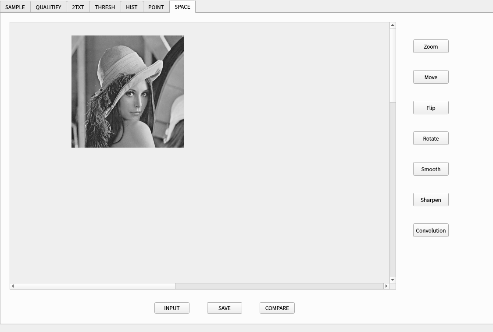
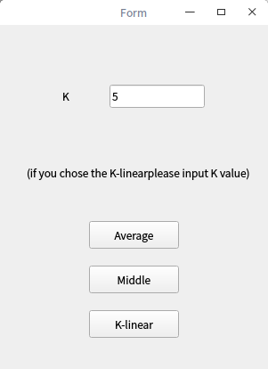

#  数字图像处理

## 开发环境：

deepin 15.5桌面版+Qt5

## 实现功能：

- 图片的输入和保存操作
- 任意采样率图像的显示
- 任意量化等级图像的显示
- 将图像转化为8位位平面表示二值图
- 实现bmp2txt技术
- 对输入图像阈值化
- 图片的灰度直方图显示
- 使图片变亮，变暗的两种线性点运算
- 显出出图片轮廓的非线性点运算
- 图像色彩均衡
- 图片简单的空间变换包括指定参数的缩放，旋转，平移，翻转
- 图片的平滑，锐化，和任意滤波的卷积操作

## 界面介绍

## 功能介绍：

#### 图片任意采样率图像显示

该功能界面在SAMPLE标签页下，包括图片现在的采样率，和目标采样率，输入目标采样率，点击sampling按钮可以实现对图片的采样率转换，支持彩色图像和灰度图像

###### 实现方式：

本质上未改变图片格式和图片的像素点数目，通过将一块区域的像素点取相同的值，来模拟采样率的改变。

具体实现方法，是通过输入的X和Y值，计算出在改变采样率后的“像素点”和改变之前像素点的关系（改变之后的像素点，由一片改变之前的像素点所组成），通常计算的结果是一个滤波的大小，令这个滤波为平均滤波，对原图像进行卷积，每次卷积的结果作为这块卷积区域的像素点的值。

###### 效果展示：

灰度图：

RGB图像

#### 图片任意量化等级的显示

该功能界面在QUALITIFY标签页面下，通过输入量化的范围，点击Grey按钮，实现对图片的任意量化等级的转化

###### 实现方式：

输入图片的每个像素点值默认储存为1个字节，即灰度值取在0~255之间，输入的Grey值，是图片要求的量化等级。256将会被分为Grey个区间，原图中，像素值在 x～x+255/Grey 之间的像素点的灰度值将被赋值为该区间的中位数。

###### 效果展示：

将图片进行二值化

#### 8位为平面图转化

#### 图像阈值化

该功能界面在THRESH标签页面下，输入确定的阈值，点击plot按钮，显示对原图进行阈值化处理后的图片，原图的灰度直方图的信息。

###### 实现方式：

以输入阈值为标准，对图像每个像素点进行二值化。

###### 效果展示：

选取阈值灰度为156：

#### 图片灰度直方图显示：

该功能界面在HIST标签之下，输入图片，点击hist按钮，可以得到图片的灰度直方图

###### 实现方式：

使用qcustomplot类进行直方图的绘制。而直方图的数据，对图片信息进行遍历，用向量储存每个像素点的值，对向量进行处理计算得到均值，中位数，方差等值。

###### 实现效果：

#### 利用线性点运算改变图片明暗

该功能界面在POINT的标签页面下，输入图片，点击Bright按钮可以适当程度的使图片变亮，点击Dim按钮可以适当程度的使图片变暗，该功能支持对输入图片连续的处理。即可以多次点击Bright或Dim按钮达到想要的明暗效果。点击Histogram按钮，还可以得到两张图的直方图的对比。

###### 实现方式：

利用
$$
C=a*c+b
$$
的线性变换公式，将图片像素中的灰度值带入该公式，其中a，b的参数是默认指定

默认参数：

将公式算出的值进行格式化判断后，输出图像

###### 效果展示：

图片变亮：

图片变暗：

直方图比较：

#### 利用非线性点运算突出图像轮廓

该功能界面在POINT标签页下，输入图片，点击profile按钮。

###### 实现方式：

$$
\frac{D_m}{2}*(1+\frac{\sin(\alpha*\pi-\frac{1}{2})}{\sin(\frac{\pi}{2}*\alpha)})
$$

$$
\frac{D_m}{2}*(1+\frac{\tan(\alpha*\pi-\frac{1}{2})}{\tan(\frac{\pi}{2}*\alpha)})
$$

遍历图片，将像素点的灰度值带入上公式，输出结果。

代码层级上实现了两种公式的调用，默认使用sin公式，内置了α的值为1.0。

###### 效果展示：

#### 图像色彩均衡

该功能界面在POINT标签页下，输入图像，点击equal按钮，再点击Histogram按钮，可以看到图像的对比和图像直方图上的变化。

###### 实现方式：

首先图片所处的灰度级范围假定未其最高灰度级-最低灰度级，要将这个范围扩大到0-255之间，

###### 效果展示:

#### 简单的空间变化

该功能界面在SPACE标签下，点击右侧对应选项，会产生不同的效果

###### 实现方式：

###### 效果展示：

输入图片：

缩放：

移动：

翻转：

旋转：

#### 平滑，锐化，任意卷积操作

###### 实现方式：

###### 效果展示：

均值平滑：

基本没有变化，只有从直方图的方差数值上看到差异

锐化：

sobel算子锐化：

任意卷积运算：

实现一个拉普拉斯加强算子的卷积

可以明显看到图像的轮廓被加强。